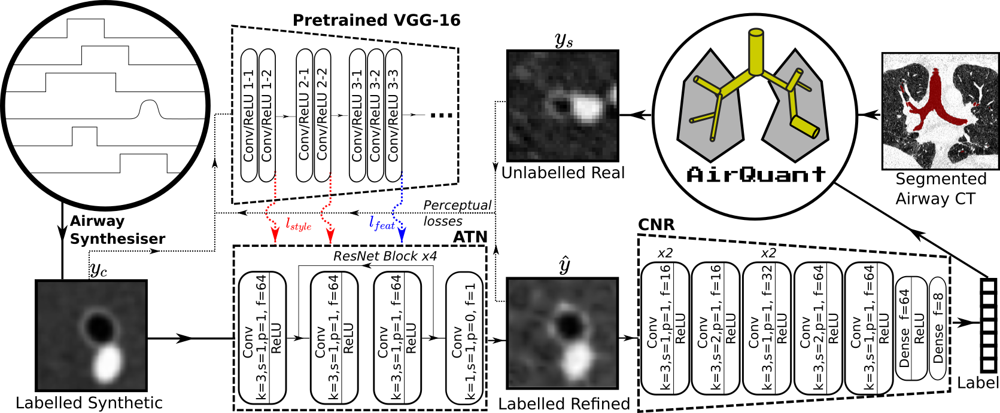
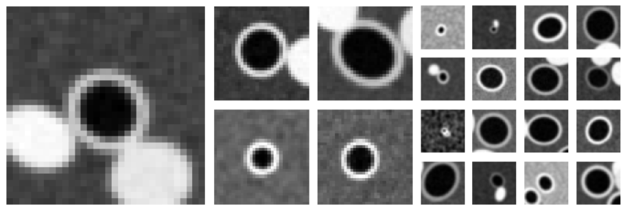
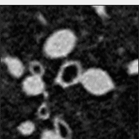

[](https://arxiv.org/abs/2208.14141)


# ATN
Official repository for **Airway measurement by refinement of synthetic
images improves mortality prediction in
idiopathic pulmonary fibrosis** published in [DGM4MICCAI](https://dgm4miccai.github.io/) 2022 [MICCAI](www.miccai.org/) satellite workshop.

Measure airways in Computed Tomography scans using deep learning models that have been trained on synthetic data created using style transfer.

This repository includes code for training the Airway Transfer Network (ATN), Convolutional Neural Regressor (CNR) and simGAN models. It also includes a synthetic airway generator which generates simplistic synthetic airway patches. It is entirely compatible with [AirQuant](https://github.com/ashkanpakzad/AirQuant), including inference functions that are fully integrated. Please read our paper for more information and full definitions.

If you use this software in any way then please cite:
```
@misc{pakzad_atn_2022,
  doi = {10.48550/ARXIV.2208.14141},
  url = {https://arxiv.org/abs/2208.14141},
  author = {Pakzad, Ashkan and Xu, Mou-Cheng and Cheung, Wing Keung and Vermant, Marie and Goos, Tinne and De Sadeleer, Laurens J and Verleden, Stijn E and Wuyts, Wim A and Hurst, John R and Jacob, Joseph},
  title = {Airway measurement by refinement of synthetic images improves mortality prediction in idiopathic pulmonary fibrosis},
  publisher = {arXiv},
  year = {2022},
  copyright = {Creative Commons Attribution 4.0 International}
}
```




# Funding
Funded by [Cystic Fibrosis Trust](https://www.cysticfibrosis.org.uk/), [EPSRC i4health](https://www.ucl.ac.uk/intelligent-imaging-healthcare/) studentship and [Wellcome Trust](https://wellcome.org/). This does not mean or imply endorsement.

# Getting started
## Install
Originally written and run in ubuntu, using python 3.9 and pytorch 1.11. There are several dependencies, we recommend using [miniconda](https://docs.conda.io/en/latest/miniconda.html) to install and manage an isolated environment. You can directly install all dependencies from `environment.yml` to run this repository using the steps below.

```
git clone https://github.com/ashkanpakzad/ATN.git
cd ATN
conda env create -f environment.yml
conda activate atn
```

## Demonstration
Included in this repository is a list of example bash snippets that can be run for demonstration. Though we do not have permission to release the dataset we used in our original paper, a sample from the public LIDC-IDRI dataset is available, though it should be noted that these patients do not have airway specific pathologies and are only suitable for demonstration. We include patches from the example dataset used in [AirQuant](https://github.com/ashkanpakzad/AirQuant), `LIDC_IDRI_0066`.

*Please note that this only includes n=10 airway patches and is not suitable for a fullscale study, in context our original data considered >375,000 patches in both the synthetic and real datasets.*

## Data

### Synthetic


We generate synthetic data by calling `GenerateSynthDataset.py` with a JSON file, e.g. `synth0make.json` that defines the airway parameter distributions to sample to generate synthetic airway patches in tiff format.


Minimal example:
```
$ python GenerateSynthDataset.py data/synthetic/synth0make.json -o data/synthetic/synth0 --N 10 --show
```

* `synth0.csv` will be generated, defining the label ellipse parameters.
* `/synth0` will contain `int16` tiffs per generated patch with intensity values in the range of typically observed Hounsfield Units (HU) for airways and the lung.

See `MakeSynthData.sh` and `$ python GenerateSynthDataset.py --help` for more details

### Real
This is acquired by sampling patches from the original CT images. We achieve this using [AirQuant](https://github.com/ashkanpakzad/AirQuant) which exports to tiff format. **10 patches are included** of a single airway, shown in the gif below.



Minimal example following AirQuant tutorial:
```
% MATLAB
AQnet.tubes(5).ExportOrthoPatches('data/real/LIDC_IDRI_0066_id5','LIDC_IDRI_0066')
```

See [AirQuant](https://github.com/ashkanpakzad/AirQuant) for more details.

### JSON header
Any real or synthetic dataset requires a header. This can be make by running `MakeDatasetHead.py` with a path to the dataset directory.

Example:
```
$ python MakeDatasetHead.py data/synthetic/synth0
$ python MakeDatasetHead.py data/real/LIDC_IDRI_0066_id5_n10
```
Your data directory should now look similar to the expected structure below.

### Expected Structure
Either `tiff` or `npy` format expected.

```
ATN
    data
        synthetic
        |    synth0make.json
        |    synth0.json
        |    synth0.csv
        |    synth0
        |    |    synth_0.tif
        |    |    synth_1.tif
        |    |    ...
        real
             LIDC_IDRI_0066_id5_n10.json
             LIDC_IDRI_0066_id5_n10
                  LIDC_IDRI_0066_id5_n10_01.tif
                  LIDC_IDRI_0066_id5_n10_02.tif
            ...
```

## Training

Model tracking uses [wandb](http://wandb.com), by default it will run in [Anonymous Mode](https://docs.wandb.ai/ref/app/features/anon) if you are not already signed in. Anonymous mode runs will expire after 7 days and will only save model checkpoints locally, so it is recommended that you register an account.

### ATN
Minimal example:
```
$ python atn.py --real_dataset data/real/LIDC_IDRI_0066_id5_n10 --synth_dataset data/synthetic/synth0 --batch_size 5 --steps 500
```
See `atn-train.sh` and `$ python atn.py --help` for more details.

### simGAN
Minimal example:
```
$ python simgan.py --real_dataset data/real/LIDC_IDRI_0066_id5_n10 --synth_dataset data/synthetic/synth0 --batch_size 5 --R_train 100 --D_train 50 --k_r 50 --RD_train 500
```
See `simgan-train.sh` and `$ python simgan.py --help` for more details.

### CNR
Training a CNR requires specifying a trained simGAN or ATN refiner model.

Minimal example:
```
$ python cnr.py --dataset data/synthetic/synth0 --refiner wandb/latest-run/files/checkpoint_480.tar --batch_size 4 --epochs 100 --train_portion 0.5
```
See `cnr-train.sh` and `$ python cnr.py --help` for more details.

This command snippet requires the last run was either ATN or simGAN with at > 500 training steps, otherwise please set `--refiner` manually.

## Inference

Inference is done in [AirQuant](https://github.com/ashkanpakzad/AirQuant) on real data. Once installed, you can add `AirwayCNR.m` to your [MATLAB path](https://uk.mathworks.com/help/matlab/ref/addpath.html). Then run inference on a whole case or airway that has already been processed.

Minimal example:
```
% MATLAB
cd ATN
% Single Airway, with index 5
AQnet.tubes(5).Measure('AirwayCNR', 'wandb/latest-run/files/best.tar');
% Whole Case
AQnet.Measure('AirwayCNR', 'wandb/latest-run/files/best.tar');
```
This code snippet requires the last run to have trained a cnr, otherwise please set the model checkpoint argument manually.

# Acknowledgments
## Code
* [Conversion of angles to double angles](https://github.com/KluvaDa/Chromosomes/)
* [Perceptual loss calculations using pretrained VGG16](https://gist.github.com/alper111/8233cdb0414b4cb5853f2f730ab95a49)

## Key literature
* [Perceptual losses for style transfer: arxiv](https://arxiv.org/abs/1603.08155)
* [simGAN: arxiv](https://arxiv.org/abs/1612.07828)

## Sample data

"LIDC-IDRI-0066", source CT image is from the LIDC-IDRI:

* Armato III, S. G., McLennan, G., Bidaut, L., McNitt-Gray, M. F., Meyer, C. R., Reeves, A. P., Zhao, B., Aberle, D. R., Henschke, C. I., Hoffman, E. A., Kazerooni, E. A., MacMahon, H., Van Beek, E. J. R., Yankelevitz, D., Biancardi, A. M., Bland, P. H., Brown, M. S., Engelmann, R. M., Laderach, G. E., Max, D., Pais, R. C. , Qing, D. P. Y. , Roberts, R. Y., Smith, A. R., Starkey, A., Batra, P., Caligiuri, P., Farooqi, A., Gladish, G. W., Jude, C. M., Munden, R. F., Petkovska, I., Quint, L. E., Schwartz, L. H., Sundaram, B., Dodd, L. E., Fenimore, C., Gur, D., Petrick, N., Freymann, J., Kirby, J., Hughes, B., Casteele, A. V., Gupte, S., Sallam, M., Heath, M. D., Kuhn, M. H., Dharaiya, E., Burns, R., Fryd, D. S., Salganicoff, M., Anand, V., Shreter, U., Vastagh, S., Croft, B. Y., Clarke, L. P. (2015). Data From LIDC-IDRI [Data set]. The Cancer Imaging Archive. https://doi.org/10.7937/K9/TCIA.2015.LO9QL9SX

* Armato SG 3rd, McLennan G, Bidaut L, McNitt-Gray MF, Meyer CR, Reeves AP, Zhao B, Aberle DR, Henschke CI, Hoffman EA, Kazerooni EA, MacMahon H, Van Beeke EJ, Yankelevitz D, Biancardi AM, Bland PH, Brown MS, Engelmann RM, Laderach GE, Max D, Pais RC, Qing DP, Roberts RY, Smith AR, Starkey A, Batrah P, Caligiuri P, Farooqi A, Gladish GW, Jude CM, Munden RF, Petkovska I, Quint LE, Schwartz LH, Sundaram B, Dodd LE, Fenimore C, Gur D, Petrick N, Freymann J, Kirby J, Hughes B, Casteele AV, Gupte S, Sallamm M, Heath MD, Kuhn MH, Dharaiya E, Burns R, Fryd DS, Salganicoff M, Anand V, Shreter U, Vastagh S, Croft BY.  The Lung Image Database Consortium (LIDC) and Image Database Resource Initiative (IDRI): A completed reference database of lung nodules on CT scans. Medical Physics, 38: 915--931, 2011. DOI: https://doi.org/10.1118/1.3528204

* Clark, K., Vendt, B., Smith, K., Freymann, J., Kirby, J., Koppel, P., Moore, S., Phillips, S., Maffitt, D., Pringle, M., Tarbox, L., & Prior, F. (2013). The Cancer Imaging Archive (TCIA): Maintaining and Operating a Public Information Repository. Journal of Digital Imaging, 26(6), 1045–1057. https://doi.org/10.1007/s10278-013-9622-7

* The authors acknowledge the National Cancer Institute and the Foundation for the National Institutes of Health, and their critical role in the creation of the free publicly available LIDC/IDRI Database used in this study.

Labels are from:
* Y. Qin, Y. Gu, H. Zheng, M. Chen, J. Yang and Y. -M. Zhu, "AirwayNet-SE: A Simple-Yet-Effective Approach to Improve Airway Segmentation Using Context Scale Fusion," 2020 IEEE 17th International Symposium on Biomedical Imaging (ISBI), 2020, pp. 809-813, doi: 10.1109/ISBI45749.2020.9098537.
